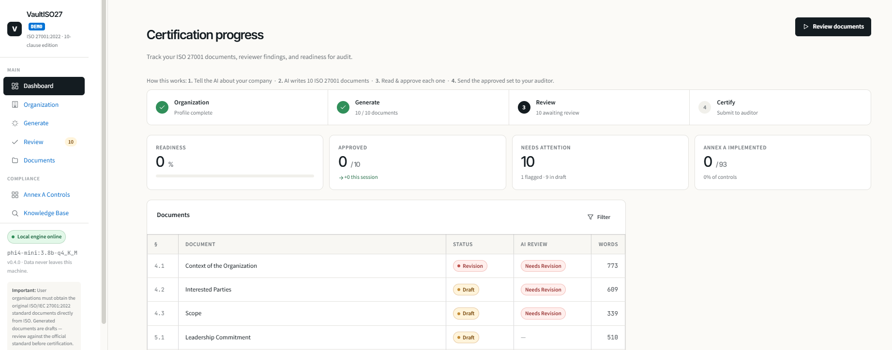
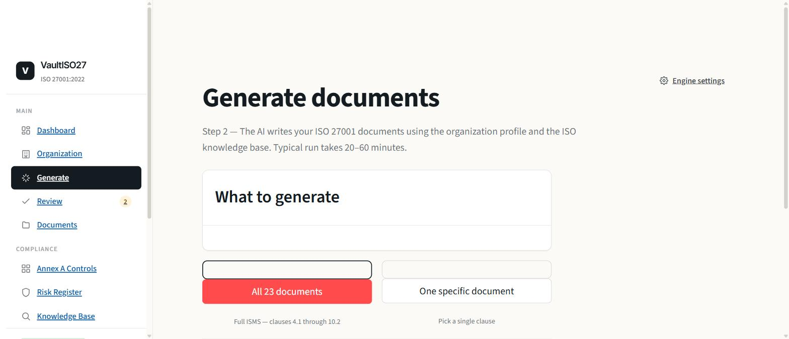
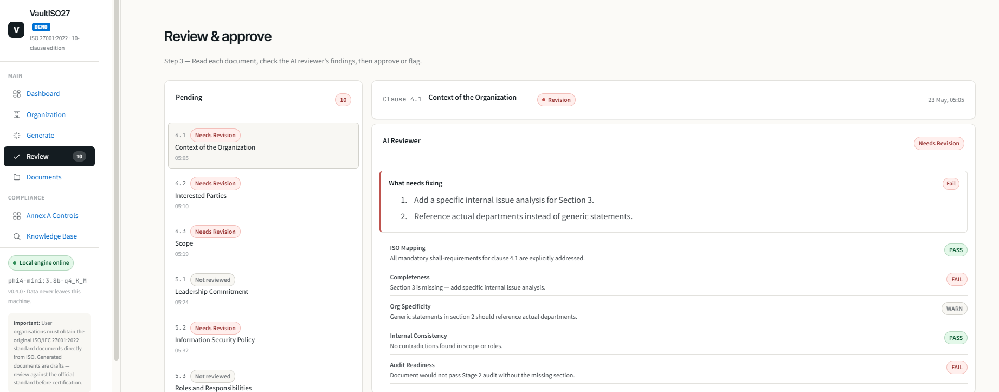
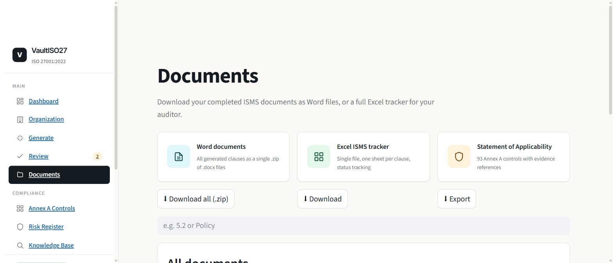
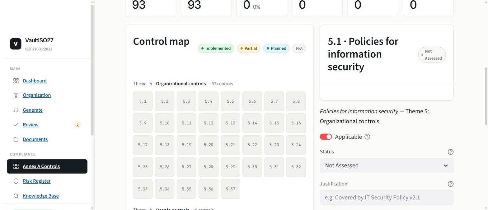

# VaultISO27 — Demo

> **10-clause demo edition** of [VaultISO27](https://github.com/BKnmz/VaultISO27) — on-premises ISO 27001:2022 ISMS document generator. No cloud. No SaaS. Your data never leaves your machine.

Generates documents for **10 mandatory clauses** (4.1, 4.2, 4.3, 5.1, 5.2, 5.3, 6.1, 6.1.2, 6.1.3, 6.2) using local LLMs via Ollama + ChromaDB RAG.

---

## Why on-premises?

- **Zero cloud exposure** — all LLM inference runs locally via Ollama; no API keys, no data upload
- **Hardware-aware** — tool detects your RAM and VRAM on startup and recommends the right model for your machine
- **Offline after setup** — first run downloads models (~3 GB); after that, fully air-gapped operation
- **SME-friendly** — no DevOps required; one-click `install.bat` + `launch.bat`

---

## Hardware detection & model guide

At launch the tool reads your hardware profile and recommends the best model:

| Hardware | Recommended model | Speed |
|----------|------------------|-------|
| 2 GB VRAM (e.g. MX230) | `phi4-mini:3.8b-q4_K_M` | ~15 tok/s |
| 2 GB VRAM (reviewer) | `qwen2.5:1.5b` | ~30 tok/s |
| 4 GB+ VRAM | `llama3.2:3b-q4_K_M` | ~18 tok/s |
| 8 GB+ VRAM | `mistral:7b-q4_K_M` | ~8 tok/s |

Only one model runs at a time (VRAM limit). The **Settings → Model Guide** tab shows your detected tier and hardware specs.

---

## Screenshots

### Dashboard — certification progress
Stepper tracks organisation setup → document generation → review → audit readiness. Readiness %, Approved/Needs Attention metrics, and per-clause status at a glance.



### Generate — document generation
Batch or single-clause generation. Live log stream shows each clause as it is drafted. Engine panel shows active model, reviewer, temperature, and RAG chunk count.



### Review — AI Reviewer findings
Per-clause AI Reviewer report with PASS / FAIL / WARN per ISO 27001 dimension. "What needs fixing" callout for non-PASS verdicts. Approve or flag for revision.



### Documents — export centre
Browse all generated clauses with status and AI review badges. Download individual Word (.docx) files or the full set as a zip.



### Annex A controls — evidence tracker
21-control evidence tracker with visual theme map. Toggle applicability, set implementation status, add justification and evidence references. Export Statement of Applicability to Excel.



---

## Quick Start

```bat
install.bat      :: one-time setup (needs internet for model download)
launch.bat       :: start dashboard — open http://localhost:8501
```

---

## Requirements

- Windows 10/11
- Python 3.9+
- [Ollama](https://ollama.com/) installed
- ~4 GB free disk (models + deps)

---

## Demo scope

10 mandatory clauses included:

| Clause | Document |
|--------|----------|
| 4.1 | Context of the Organization |
| 4.2 | Interested Parties |
| 4.3 | ISMS Scope |
| 5.1 | Leadership Commitment |
| 5.2 | Information Security Policy |
| 5.3 | Organizational Roles and Responsibilities |
| 6.1 | Risk Planning |
| 6.1.2 | Risk Assessment |
| 6.1.3 | Risk Treatment |
| 6.2 | Security Objectives |

Full 23-clause tool → [BKnmz/VaultISO27](https://github.com/BKnmz/VaultISO27)

---

## Workflow

```
Step 1 — Settings    Fill in org profile (name, sector, locations, departments)
Step 2 — Generate    Pipeline drafts each clause via phi4-mini + RAG context
Step 3 — Review      AI Reviewer scores draft; approve or flag for revision
Documents            Export to Word (.docx) or download all as zip
Annex A              Track evidence per ISO 27001:2022 control; export SoA to Excel
```

---

## Architecture

```
org profile + RAG (ChromaDB)  →  Jinja2 skill template  →  phi4-mini (Ollama)
                                                         →  .md document
                                                         →  qwen2.5 AI Reviewer
                                                         →  Word / Excel export
```

All inference local. All data local. Zero telemetry.

---

## Legal

**ISO/IEC 27001:2022** is © ISO/IEC. This tool does **not** redistribute the standard text.

The audit checklist (`rag/ISO27001_Audit_Checklist_demo.xlsx`) contains original paraphrases of 21 Annex A controls — not verbatim ISO text. See the **LEGAL_NOTICE** sheet inside the file and [NOTICE.md](NOTICE.md) for details.

Generated documents are drafts. Review against the official standard before any certification process. Source code: [Elastic License 2.0](LICENSE) — free for internal use, no redistribution. Checklist paraphrases: CC BY 4.0.
